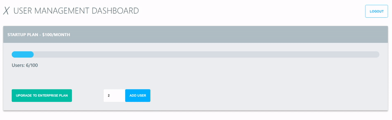

### Demo
Please visit https://kangbojk.github.io/go-react-fullstack/ for demo.


### Code Structure
```
.
├── Dockerfile
├── Makefile
├── Procfile
├── README.md
├── cmd
│   └── main.go
├── docker-compose.yaml
├── go.mod
├── go.sum
├── pkg
│   ├── ID
│   │   └── id.go
│   ├── entity
│   │   ├── account
│   │   │   ├── entity.go
│   │   │   ├── fixture.go
│   │   │   └── manager.go
│   │   └── tenant
│   │       ├── entity.go
│   │       └── fixture.go
│   ├── password
│   │   └── password.go
│   ├── server
│   │   ├── data
│   │   │   ├── account.go
│   │   │   └── tenant.go
│   │   ├── middleware
│   │   ├── router
│   │   │   ├── auth.go
│   │   │   ├── handler.go
│   │   │   ├── jwt.go
│   │   │   ├── router.go
│   │   │   ├── router_test.go
│   │   │   └── ws.go
│   │   └── server.go
│   ├── storage
│   │   ├── db
│   │   │   └── account_repo_pg.go
│   │   └── memory
│   │       ├── account_repo_mem.go
│   │       ├── account_repo_mem_test.go
│   │       └── tenant_repo_mem.go
│   └── usecase
│       ├── interface.go
│       ├── usecase.go
│       └── usecase_test.go
└── web
```

### Design principle
The design of this application follows clean/hexagonal architecture.

(To learn more about this pattern, please refer to [Building an enterprise service in Go](https://youtu.be/twcDf_Y2gXY) and [How Do You Structure Your Go Apps](https://youtu.be/oL6JBUk6tj0).)

Clean/hexagonal architecture let you separate application in layers
* Entity (Data object)
* Repository (CRUD associate with DB adapter)
* Use Case/Service (Business logic)
* Delivery (Presenter, interact/generate data)

 each layer is responsible for specific task, made easy for testing(stub, mock) and adding plugable module.


#### WebSocket
[gorilla/websocket](https://github.com/gorilla/websocket) is used to update progress bar. 



One can use AJAX to update the progress bar with polling, but here WebSocket is used as demonstration to substitute polling.
(Note that this application was originally served as a dashboard, it received command from other endpoint. If a notify mechanism is not implemented, we have to choose polling.)

#### Auth
[Session](https://github.com/gorilla/sessions) based authentication is used in this application. Keep in mind that duplicate session associate with same user name and overwritten registration do occur (Will refactor in the future).

Lightweight authorization is implemented with RBAC, with the the help of **actions** attribute in Account entity.

```
type Account struct {
	ID        id.ID     `json:"id"`
	Email     string    `json:"email"`
	Password  string    `json:"password"`
	Actions   string    `json:"actions"`
	TenantID  id.ID     `json:"tenant_id"`
	CreatedAt time.Time `json:"created_time"`
	UpdatedAt time.Time `json:"updated_time"`
}
```

#### TLS

#### DB

#### Test

#### React
Frontend is developed with React (both hook & class), source in [web/](web/) folder.

#### Deployment
Currently the frontend is deployed to Github page and backend server is deployed to Heroku (Free tier so it takes 2-3 seconds for wake up). No DB support yet (in memory storage for the time being), might switch to MongoDB Altas.